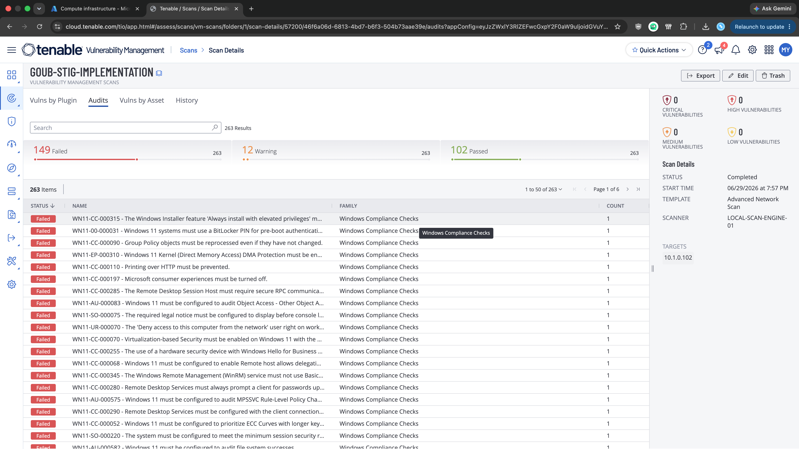
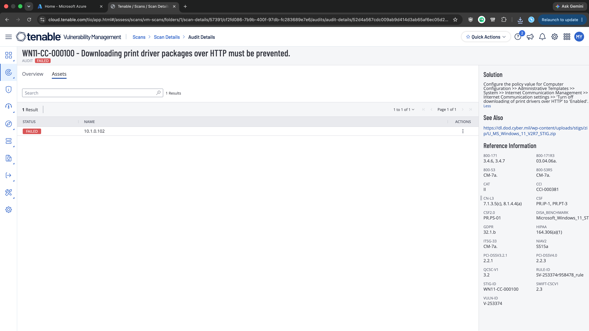
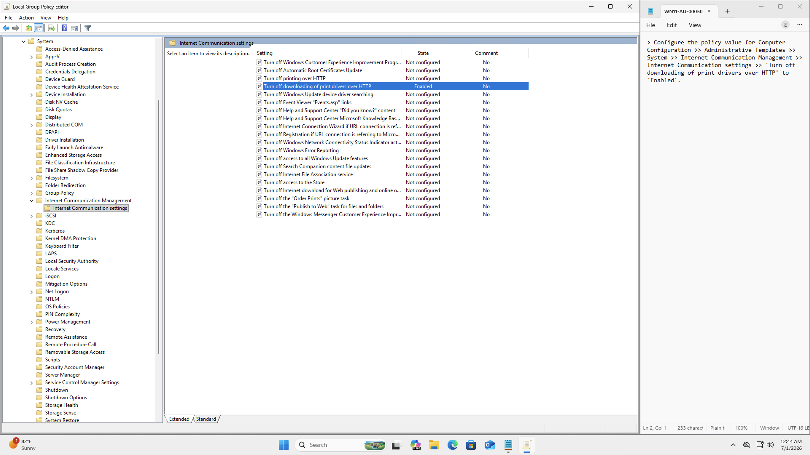
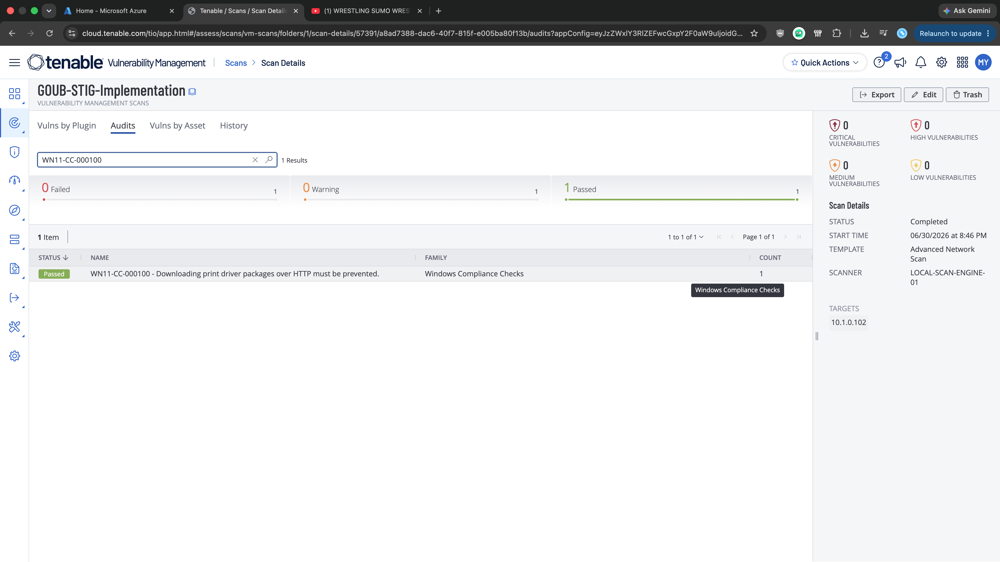
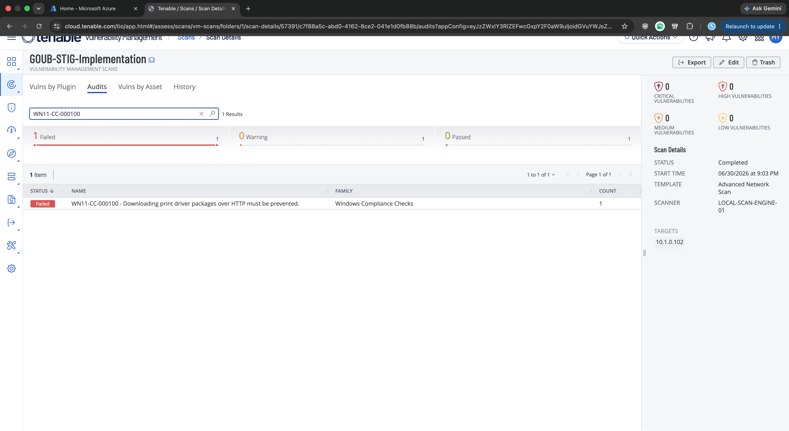
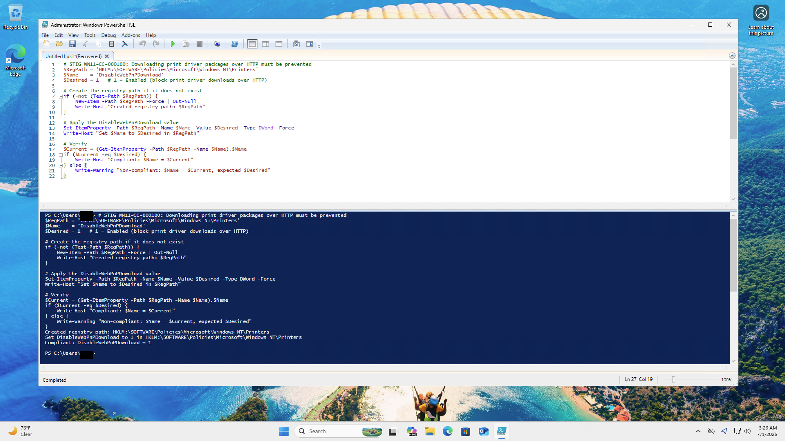
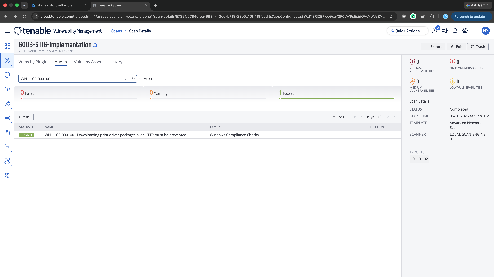

# Windows 11 STIG 04: V-253374 (WN11-CC-000100)

**Status:** Published
**STIG:** DISA Microsoft Windows 11 Security Technical Implementation Guide v2r7
**Finding:** V-253374 (WN11-CC-000100)

Part of the [DISA STIG Implementation with PowerShell](https://github.com/goubx/DISA-STIG-Implementation-w-PowerShell-series-) series.

---

## Overview

This entry hardens a stock Azure Windows 11 VM against one finding from the DISA Microsoft Windows 11 STIG v2r7 using PowerShell. The workflow:

1. Scan an unhardened Azure VM with Tenable's DISA STIG compliance audit.
2. Pick a failed finding from the Audit tab.
3. Remediate it manually to confirm the fix path.
4. Translate that fix into an idempotent PowerShell function.
5. Rescan to confirm the finding moves to passed.

Registry-based finding under `HKLM:\SOFTWARE\Policies\Microsoft\Windows NT\Printers`. The manual fix is a single GPO toggle; the PowerShell equivalent is a short `Set-ItemProperty` script.

---

## Target Platform

| Field            | Value                          |
|------------------|--------------------------------|
| OS               | Windows 11 Pro                 |
| Azure VM         | Standard                       |
| Private IP       | 10.1.0.102                     |
| Domain joined    | No                             |

---

## Tools Used

| Tool                          | Purpose                                       |
|-------------------------------|-----------------------------------------------|
| Tenable Nessus                | Scanning with the DISA STIG audit             |
| Windows PowerShell ISE        | Remediation engine                            |
| Local Group Policy Editor     | Manual remediation pass                       |
| Tenable audit detail          | Finding reference (Solution + metadata)       |
| Azure                         | Lab VM hosting                                |

---

## Lab Setup

The lab uses a stock Azure Windows 11 VM with Windows Defender Firewall disabled so the Tenable scanner can reach the host across the lab network:


> Note: this is a lab-only step. In production you would scope firewall rules to permit the scan engine rather than disabling the firewall outright.

---

## Scan Configuration

The Tenable scan that produced this finding uses the Advanced Network Scan template, configured once and reused across all findings in this series:

1. **Scans → Create Scan → Advanced Network Scan**
2. Name: `GOUB-STIG-IMPLEMENTATION`
3. Target: the VM's private IP (`10.1.0.102`)
4. Scanner: internal scan engine
5. Credentials: local administrator on the VM

### Compliance audit

Under the Compliance tab, the DISA Microsoft Windows 11 STIG v2r7 audit is added:


### Plugin scoping

To keep the scan fast and focused on STIG findings only, every plugin family is disabled except one:

1. Plugins, filter for `policy`, enable **Policy Compliance**.
2. Inside Policy Compliance, enable only **Windows Compliance Checks** (Plugin ID 21156).


---

## Initial Scan

The scan against the Azure VM returned 149 failed audits out of 263 total checks. STIG findings on a default Windows 11 image are dense, which makes this a good source of remediation work:



The finding this repo documents:

> **WN11-CC-000100** : Downloading print driver packages over HTTP must be prevented.

Without this control, Windows will fetch print driver packages from arbitrary web hosts over HTTP when adding a printer. A driver package is arbitrary code with kernel-mode components, so a hijacked or spoofed source is a straightforward path to code execution on the workstation.

---

## Finding Details

Pulled from the Tenable audit detail page:

| Field            | Value                          |
|------------------|--------------------------------|
| STIG ID          | WN11-CC-000100                 |
| Vulnerability ID | V-253374                       |
| Severity         | Medium (CAT II)                |
| CCI              | CCI-000381                     |
| Rule ID          | SV-253374r958478_rule          |



**Why it matters:** Point-and-Print driver downloads over HTTP are unauthenticated and unencrypted, so the driver source can be tampered with in transit or replaced by a malicious host. Blocking this means the OS won't pull driver packages from web servers when a user tries to install a printer.

**Fix per DISA:**
> Configure the policy value for Computer Configuration > Administrative Templates > System > Internet Communication Management > Internet Communication settings > "Turn off downloading of print drivers over HTTP" to "Enabled".

Translated to the registry:

| Field         | Value                                                              |
|---------------|--------------------------------------------------------------------|
| Hive          | HKEY_LOCAL_MACHINE                                                 |
| Path          | `\SOFTWARE\Policies\Microsoft\Windows NT\Printers`                 |
| Value Name    | DisableWebPnPDownload                                              |
| Value Type    | REG_DWORD                                                          |
| Value Data    | 0x00000001 (1)                                                     |

---

## Step 1: Manual Remediation

Opened Local Group Policy Editor (`gpedit.msc`) and navigated to:

> Computer Configuration > Administrative Templates > System > Internet Communication Management > Internet Communication settings

Then set **"Turn off downloading of print drivers over HTTP"** to **Enabled**:



After restarting the VM and rerunning the Tenable scan, the finding passes:



The manual fix works. Now to translate it into a script.

---

## Step 2: Capture the Registry Export

The correct registry state, after the GPO change, is:

```reg
Windows Registry Editor Version 5.00

[HKEY_LOCAL_MACHINE\SOFTWARE\Policies\Microsoft\Windows NT\Printers]
"DisableWebPnPDownload"=dword:00000001
```

That tells the script exactly what to produce: the `Windows NT\Printers` key under `Policies\Microsoft`, a DWORD named `DisableWebPnPDownload`, and the value `0x00000001`.

---

## Step 3: Revert and Re-verify

I reverted the Group Policy setting back to "Not Configured" and reran the scan. The finding is failed again, as expected:



Now there's a clean baseline to validate the script against.

---

## Step 4: PowerShell Remediation

```powershell
function Set-StigRule-V253374 {
    <#
    .SYNOPSIS
        V-253374: Downloading print driver packages over HTTP must be prevented.

    .DESCRIPTION
        Severity:        CAT II (Medium)
        STIG ID:         WN11-CC-000100
        CCI:             CCI-000381
        Tenable Plugin:  Windows Compliance Checks (21156)
        Reference:       DISA Microsoft Windows 11 STIG v2r7

        Blocks Point-and-Print driver downloads from web hosts over HTTP.
        Sets DisableWebPnPDownload to 1 under the Windows NT\Printers policy
        key, which is the registry change Group Policy makes when enabling
        "Turn off downloading of print drivers over HTTP".

    .EXAMPLE
        Set-StigRule-V253374
    #>
    [CmdletBinding(SupportsShouldProcess)]
    param()

    $RegPath = 'HKLM:\SOFTWARE\Policies\Microsoft\Windows NT\Printers'
    $Name    = 'DisableWebPnPDownload'
    $Desired = 1   # 1 = Enabled (block print driver downloads over HTTP)

    # Create the registry path if it does not exist
    if (-not (Test-Path $RegPath)) {
        New-Item -Path $RegPath -Force | Out-Null
        Write-Host "Created registry path: $RegPath"
    }

    # Apply the DisableWebPnPDownload value
    Set-ItemProperty -Path $RegPath -Name $Name -Value $Desired -Type DWord -Force
    Write-Host "Set $Name to $Desired in $RegPath"

    # Verify
    $Current = (Get-ItemProperty -Path $RegPath -Name $Name).$Name
    if ($Current -eq $Desired) {
        Write-Host "Compliant: $Name = $Current"
    } else {
        Write-Warning "Non-compliant: $Name = $Current, expected $Desired"
    }
}
```

What it does, in order:

1. **Check path.** `Test-Path` confirms whether the `Windows NT\Printers` policy key exists.
2. **Create if missing.** `New-Item -Force` creates the key and any missing parents.
3. **Set the value.** `Set-ItemProperty` writes `DisableWebPnPDownload` as a DWord with the desired data (1).
4. **Verify.** Reads the value back and emits a Compliant or Non-compliant line.

Running it from an elevated PowerShell ISE session against the reverted baseline:



Output:

```
Created registry path: HKLM:\SOFTWARE\Policies\Microsoft\Windows NT\Printers
Set DisableWebPnPDownload to 1 in HKLM:\SOFTWARE\Policies\Microsoft\Windows NT\Printers
Compliant: DisableWebPnPDownload = 1
```

---

## Step 5: Final Validation

After restarting the VM and rerunning the same Tenable scan, the finding passes:



---

## Result

| Stage                        | WN11-CC-000100 |
|------------------------------|----------------|
| Initial scan                 | Failed         |
| After manual remediation     | Passed         |
| After reverting              | Failed         |
| After PowerShell remediation | Passed         |

The finding was cleared both by hand and programmatically, with the scan-pass state proven against a clean baseline both times.

---

## Notes

### Operational impact
The setting blocks the OS from fetching print driver packages from web hosts over HTTP when adding a printer. Users installing printers can still pull drivers from Windows Update or from an internal print server, which are the standard enterprise paths anyway. No services restarted, no follow-up action required.

### STIG version note
While researching the finding I noticed the Tenable audit template loaded in the scan is DISA Windows 11 STIG v1r6 (August 2024), while the current DISA release is v2r7 (June 2026). The V-ID, STIG ID, and remediation for this specific rule are unchanged between the two versions, so the fix stands, but for a real engagement I'd swap the audit template to v2r7 to catch anything added or reworded since v1r6. Worth noting on a control review: the scan template version isn't always the current STIG release.

---

## References

- [DISA STIG Library](https://public.cyber.mil/stigs/)
- [STIG-A-View entry for V-253374](https://www.stigaview.com/products/windows-11/v2r7/V-253374/)
- [Tenable Plugin Database](https://www.tenable.com/plugins/search)
